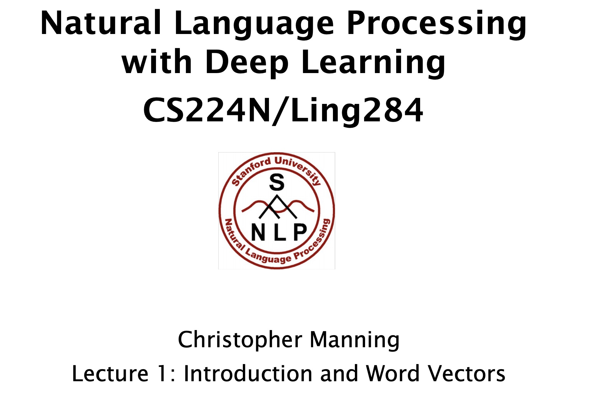

# 自然语言理解
> 更新日期：2020年3月28日
## 书籍推荐
1. 《[Speech and Language Processing, 2nd Edition](https://book.douban.com/subject/2403834//)》
    - 内容全面，覆盖面广
2. 《统计自然语言处理》 宗成庆
3. 《信息检索导论》
4. 《语言本能-人类语言进化的奥秘》
## 什么是 自然语言 理解？
### 自然语言？
1. 和编程语言相对的语言称为自然语言。
### 自然语言理解？
1. 目的：使计算机理解人类的自然语言。
2. 本质：结构预测的过程。如输出一句话的句法结构或者语义结构。
3. 从无结构化序列预测有结构的语义。
    - 词性标注、命名实体识别、依存分析、句法分析、指代消解等任务。
4. 数据驱动的自然语言理解
    - 深度学习技术的突破
5. 语义表示（核心）
    - one-hot （0/1）也称独热编码
        + 表示简单，但局限性很大，如相似度计算。
    - 分布式语义表示 （空间表示）
        + 目前最主要的表示形式。
        + 1986年提出的方法。
### 自然语言的特点
1. 歧义性多。
    ```
    南京市/长江大桥。南京市长/江大桥。
    ```
    - 关键目标：消除歧义性。
2. 递归性
    ```
    你好/不好意思。 你/好不好意思。
    ```
3. 主观性
    ```
    仔细体会这两句：别回了。 我没事，你忙你的。
    ```
4. 社会性
    - 敬语、语言协调等
### 难点
1. 语言的语义表示
    - 世界（社会/客观）、心智（人/主观）、语言三者相互影响。
2. 将人类的知识融入到语义表示的过程中。
    - 人类知识相当于给足了上下文信息
3. 多模态复杂语境的理解 (说话的表情、手势动作、场景等)
    - 欢迎/新老/师生/前来/参观！
    - 欢迎/新老师/生前/来参观！
### 未来
1. 句子消歧。
2. 引入知识。如知识图谱。
3. 多级的跨句子建模。
4. 生成句子更符合当下对话场景。
5. 理解并创作。
### 自然语言理解交叉科学
1. 计算机科学
2. 脑科学
3. 语言学
4. 语言哲学
5. 心理学、社会学、认知学
6. 神经语言学、汉语言学

## 自然语言技术方向
### 基于规则驱动

### 基于数据驱动
- 统计学语言模型
- 深度语言模型

## NLP国内外优秀学者及实验室
- [Christopher Manning](https://nlp.stanford.edu/~manning/)

# CS224n-2019-课程笔记 by Chris Manning
> [CS224n-2019](https://web.stanford.edu/class/archive/cs/cs224n/cs224n.1194/).课程源自斯坦福CS course，2019年发布的自然语言处理，算是NLP的经典吧，老爷子讲的也很风趣幽默。Ok, Hello, everyone!一起来追剧吧。
## 一些说明和资源
- [课程主页](http://web.stanford.edu/class/cs224n/index.html)
- 本笔记涉及代码部分将使用pipenv构建虚拟环境。（推荐）
- 课后作业使用PyTocrh框架使用。
    + HW1-HW5.
    + FP,which is QA .
- [B站资源](https://www.bilibili.com/video/BV1Eb411H7Pq/?spm_id_from=333.788.videocard.0)
- [笔记参考](https://looperxx.github.io/CS224n-2019-01-Introduction%20and%20Word%20Vectors/)
## 词向量（Word Vectors)

### 自然语言和词义
1. 自然语言
    - 你永远无法确定任何单词对他人意味着什么。（中文这个情况就更普遍啦）
    - 写作是另一件让人类变得强大的事情，这实现了知识的传播和共享。
2. 语言的意义
    - 通过一个词或句子等来表达概念
    - 人们通过文字或声音信号等来表达思想、想法
    - 在写作、艺术中表达含义
一般通过下面这种普遍语言方式进行意义的思考:
    signifier(symbol)⇔signified(idea or thing) =denotational semantics 
3. 语义计算
    - 常见方案的不足
        + 类似[WordNet](https://wordnet.princeton.edu/)一个面向语义的英语词典，包含上义词（hypernyms）、同义词（synonym sets）。
            - 没有考虑上下文，忽略一个词的细微差别
            - 不能及时更新。
            - Can’t compute accurate word similarity
        + 传统NLP的做法。离散符号表示。one-hot，0-1进行编码：Means one 1, the rest 0s
            - 向量大小就是词汇表的大小（很多无用的信息）
            - 无法计算相似度。如下例两个词向量是正交的，点积为0.
            ```
            motel = [0 0 0 0 0 0 0 0 0 0 1 0 0 0 0]
            hotel = [0 0 0 0 0 0 0 1 0 0 0 0 0 0 0]
            ```
    - 提取新方案
        + Could try to rely on WordNet’s list of synonyms to get similarity?
        + learn to encode similarity in the vectors themselves（学习词自身的编码信息）
4. 通过上下文表示词
    - 分布式语义：一个词的含义往往是由附近高频出现的词决定的。
    - word出现在文本中，这个Word周围会有由词的集合组成的Context出现。这个上下文是固定一个窗口size的。
    - 我们可以使用存在Word的大量[语料](http://ling.cuc.edu.cn/RawPub/)来学习其向量表示。比如学习“中国科学院”词（实际中会学习每个词），在下列的语料中。
        ```
            1.先向获得2009年度国家最高科学技术奖的**中国科学院**院士、复旦大学数学研究所名誉所长谷超豪和
            2.院士、复旦大学数学研究所名誉所长谷超豪和**中国科学院**院士、中国航天科技集团公司高级技术顾
            3.大国”向“造船强国”迈进。 由**中国科学院**和上海市政府共同建设的上海同步辐射光源工
            4. 丽；河南卓越工程管理有限公司董事长邬敏**中国科学院**研究生院教授杨佳十人“全国三八红旗手
        ```
### Word Vectors(词向量)

### Word2Vector介绍

### Word2Vector目标函数梯度下降

### 优化误差

### 总结


